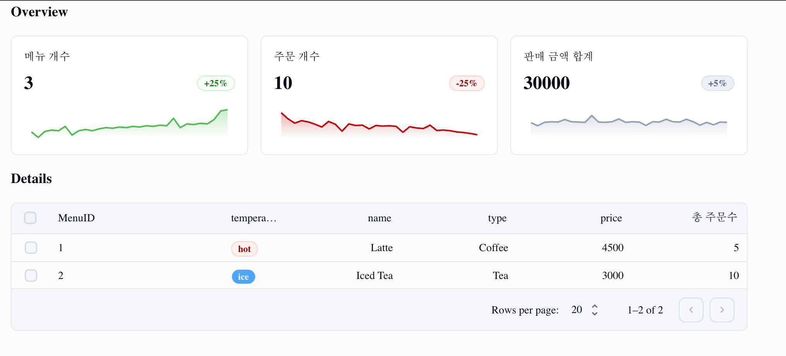

# 스파르타 베이직 카페


## 목차
1. [프로젝트 설정](#프로젝트-설정)
2. [API 엔드포인트](#api-엔드포인트)
3. [데이터베이스 설정](#데이터베이스-설정)
4. [데이터베이스 연동](#데이터베이스-연동)
5. [실행 방법](#실행-방법)

---

## 프로젝트 설정

1. **레포지토리 클론**:
   ```bash
   git clone <repository-url>
   cd <project-directory>
   ```

2. **의존성 설치**:
   이 프로젝트는 Node.js와 Express를 사용합니다. 필요한 패키지를 설치하려면 아래 명령어를 실행하세요:
   ```bash
   npm install
   ```

## API 엔드포인트

이 API는 두 가지 엔드포인트를 제공합니다:

1. **GET `/stats`**:
   메뉴 수, 주문 수, 총 매출과 관련된 통계를 반환합니다.

   **응답**:
   ```json
   {
       "stats": {
           "totalMenus": 3,
           "totalOrders": 10,
           "totalSales": 30000
       }
   }
   ```

2. **GET `/`**:
   사용 가능한 메뉴 목록을 반환합니다.

totalOrders 는 해당 메뉴의 총 주문 수를 나타냅니다.
이 값을 제외하고 기능을 개발하고 마지막으로 totalOrders 를 추가하세요.

   **응답**:
   ```json
   {
       "menus": [
           {
               "id": 1,
               "name": "Latte",
               "type": "Coffee",
               "temperature": "hot",
               "price": 4500,
               "totalOrders": 5
           },
           {
               "id": 2,
               "name": "Iced Tea",
               "type": "Tea",
               "temperature": "ice",
               "price": 3000,
               "totalOrders": 10
           }
       ]
   }
   ```

## 데이터베이스 설정

1. **데이터베이스 생성**:
   기존에 구축하였던 MySQL 를 사용하세요.

2. **데이터 입력**:
   API가 메뉴와 통계를 조회할 수 있도록 데이터베이스에 샘플 데이터를 추가하세요.

## 데이터베이스 연동

제공된 코드는 현재 정적 JSON 데이터를 반환합니다. 이를 프리즈마를 사용해서 실제 데이터베이스와 연동해주세요.

1. **API 코드 업데이트**:
   `router.get('/stats')`와 `router.get('/')` 경로를 수정하여 데이터베이스에서 데이터를 조회하도록 변경합니다.

## 실행 방법

1. **서버 실행**:
   데이터베이스 설정을 완료하고, API를 데이터베이스와 연동한 후, Node.js 서버를 실행합니다:
   ```bash
   npm run start
   ```

2. **API 테스트**:
   [Postman](https://www.postman.com/), **Insomnia** 또는 `curl` 같은 도구를 사용하여 API를 테스트할 수 있습니다. 예를 들어:

   ```bash
   curl http://localhost:4000/stats
   curl http://localhost:4000/
   ```

라우터 코드를 수정하면 아래 화면의 값이 변경됩니다.



## 추가 정보

- 대소문자를 포함하여 오탈자가 있을 경우 화면에 값이 보이지 않을 수 있습니다. 명세를 확인해주세요.
- 막히는게 있으면 언제든지 튜터님들을 찾아주세요!

